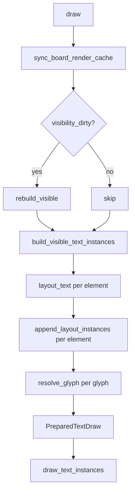

# Text Instance Caching Design

## Problem

During panning, [`build_visible_text_instances()`](src/text.rs:63) is called every frame and performs expensive work that produces byte-identical results:

1. **Shaping** — `Buffer::new()` + `set_text()` + `shape_until_scroll()` for every visible text element via [`layout_text()`](src/text.rs:357)
2. **Glyph iteration** — HashMap lookups in [`resolve_glyph()`](src/text.rs:285) to build instance vectors via [`append_layout_instances()`](src/text.rs:224)
3. **Sorting** — candidates sorted by distance to camera — O(N log N)
4. **GPU upload** — identical `PreparedTextDraw` data re-uploaded every frame

During panning, none of the text content, font sizes, or element dimensions change. Only the camera position changes, which is handled by the MVP uniform in the shader. All world-space glyph positions are stable.

## Architecture Overview



## Design: Two-Level Cache

### Level 1 — Per-Element Layout Cache

Cache the [`LaidOutText`](src/text.rs:391) result per element to skip the expensive cosmic_text shaping pipeline.

#### Cache Key

A layout is valid as long as these inputs are identical:

| Input | Source |
|-------|--------|
| `content` | `element.text.content` or `active_edit.content` |
| `font_size` | `element.text.font_size` |
| `color` | `element.text.color` |
| `element bounds` | `element.pos`, `element.size` — fed into [`text_bounds()`](src/board.rs:72) |

Rather than hashing all inputs, we use a **generation counter** — a `u64` bumped whenever any text-affecting property changes on an element. This is cheaper than hashing string content every frame.

#### Struct Changes in [`text.rs`](src/text.rs)

```rust
// New struct to hold a cached layout for one element
struct CachedLayout {
    buffer: Buffer,
    world_min: Vec2,
    text: TextData,
    /// Generation at which this layout was created.
    generation: u64,
}

// Add to TextSystem:
pub struct TextSystem {
    font_system: FontSystem,
    swash_cache: SwashCache,
    mono_atlas: Atlas,
    emoji_atlas: Atlas,
    overlay_ready: bool,
    // --- NEW ---
    /// Per-element layout cache, keyed by element id.
    layout_cache: HashMap<u64, CachedLayout>,
}
```

#### Modified [`layout_text()`](src/text.rs:357)

```rust
fn layout_text(
    &mut self,
    element: &Element,
    content: &str,
    generation: u64,       // NEW parameter
) -> Option<LaidOutText> {
    // Check cache first
    if let Some(cached) = self.layout_cache.get(&element.id) {
        if cached.generation == generation {
            // Return a borrow-compatible reference to the cached layout
            return Some(LaidOutText {
                buffer: &cached.buffer,   // see note below on borrowing
                world_min: cached.world_min,
                text: cached.text.clone(),
            });
        }
    }

    // Cache miss — do full shaping (existing code)
    let (world_min, world_max) = element.text_bounds()?;
    let text = element.text.clone().unwrap_or_default();
    let width = (world_max.x - world_min.x).max(1.0);
    let height = (world_max.y - world_min.y).max(1.0);
    // ... existing Buffer::new, set_text, shape_until_scroll ...

    // Store in cache
    self.layout_cache.insert(element.id, CachedLayout {
        buffer: buffer.clone(),  // or move + return ref
        world_min,
        text: text.clone(),
        generation,
    });

    Some(LaidOutText { buffer, world_min, text })
}
```

> **Borrowing note:** cosmic_text `Buffer` does not implement `Clone`. The implementation should restructure so that `layout_text` returns a reference into the cache entry rather than an owned value. The method becomes a two-phase lookup: insert-if-missing, then return `&CachedLayout`. The `LaidOutText` struct is replaced by direct use of `&CachedLayout` in [`append_layout_instances()`](src/text.rs:224) and [`build_edit_overlay_instances()`](src/text.rs:168). See **Implementation Notes** below.

### Level 2 — Frame-Level Instance Cache

Cache the final [`PreparedTextDraw`](src/text.rs:33) to skip all glyph iteration, HashMap lookups, sorting, and GPU upload.

#### Cache Validity

The cached `PreparedTextDraw` is valid when ALL of these are true:

| Condition | How to check |
|-----------|-------------|
| Visible set unchanged | `visibility_dirty` was not set since last text build |
| No text content changed | `text_dirty` flag is false |
| Active edit state unchanged | Cached `active_edit` snapshot matches current |
| No elements added/removed | `board_cache_dirty` was not set |

#### Struct Changes in [`app.rs`](src/app.rs)

```rust
pub struct App {
    // ... existing fields ...

    // --- NEW ---
    /// Cached text draw result from the previous frame.
    cached_text_draw: Option<PreparedTextDraw>,
    /// Set to true when any text-affecting change occurs.
    text_dirty: bool,
    /// Snapshot of active_edit state used to validate the cache.
    cached_text_edit_snapshot: Option<TextEditSnapshot>,
}

/// Lightweight snapshot of the active text edit state for cache comparison.
#[derive(Clone, PartialEq)]
struct TextEditSnapshot {
    element_id: u64,
    content: String,
    cursor_byte: usize,
    selection_anchor_byte: Option<usize>,
}
```

#### Modified [`draw()`](src/app.rs:377) Flow

```rust
fn draw(&mut self) {
    // ... frame timing, sync_board_render_cache ...

    // Build current edit snapshot
    let current_edit_snapshot = self.text_edit.as_ref().map(|edit| TextEditSnapshot {
        element_id: edit.element_id,
        content: edit.buffer.clone(),
        cursor_byte: edit.cursor_byte,
        selection_anchor_byte: edit.selection_anchor_byte,
    });

    // Check if we can reuse cached text
    let text_cache_valid = !self.text_dirty
        && !self.visibility_dirty   // check BEFORE clearing in sync_board_render_cache
        && self.cached_text_draw.is_some()
        && self.cached_text_edit_snapshot == current_edit_snapshot;

    let text_instances = if text_cache_valid {
        // FAST PATH: reuse cached PreparedTextDraw
        self.cached_text_draw.as_ref().unwrap()
    } else {
        // SLOW PATH: rebuild
        let active_text_edit = current_edit_snapshot.as_ref().map(|snap| ActiveTextEdit {
            element_id: snap.element_id,
            content: &snap.content,
            cursor_byte: snap.cursor_byte,
            selection_anchor_byte: snap.selection_anchor_byte,
        });

        let prepared = self.text_system.build_visible_text_instances(
            &mut *self.ctx,
            self.renderer.text_atlas(),
            self.renderer.emoji_atlas(),
            &self.board,
            self.board_render_cache.visible_board_indices(),
            &self.camera,
            active_text_edit,
        );

        self.cached_text_draw = Some(prepared);
        self.cached_text_edit_snapshot = current_edit_snapshot;
        self.text_dirty = false;
        self.cached_text_draw.as_ref().unwrap()
    };

    // ... draw text_instances as before ...
}
```

**Critical ordering note:** The `visibility_dirty` check for the text cache must happen *before* [`sync_board_render_cache()`](src/app.rs:300) clears it. We capture a `visibility_changed` flag before the sync:

```rust
let visibility_changed = self.visibility_dirty;
self.sync_board_render_cache();
// ... later use visibility_changed in text_cache_valid check
```

## Dirty Flag Integration

### What Sets `text_dirty = true`

| Trigger | Location | Mechanism |
|---------|----------|-----------|
| Text content edited — char typed, deleted, pasted | [`insert_text()`](src/app.rs:900), [`delete_backward()`](src/app.rs:913), [`delete_forward()`](src/app.rs:930), [`delete_selection()`](src/app.rs:886) | Add `self.text_dirty = true` after mutation |
| Text edit session begins | [`begin_text_edit()`](src/app.rs:746) | `self.text_dirty = true` |
| Text edit session ends | [`finish_text_edit()`](src/app.rs:769) | `self.text_dirty = true` |
| Cursor/selection changes | [`set_text_cursor()`](src/app.rs:819), [`move_text_cursor()`](src/app.rs:826), [`select_all_text()`](src/app.rs:855) | Handled by `cached_text_edit_snapshot` comparison — no need for dirty flag |
| Element text property changed via undo/redo | [`mark_board_structure_dirty()`](src/app.rs:271) | `self.text_dirty = true` |
| Elements added/removed | [`mark_board_structure_dirty()`](src/app.rs:271) | `self.text_dirty = true` |
| Element position/size changed — drag, resize | [`mark_elements_dirty()`](src/app.rs:283) | `self.text_dirty = true` |
| Snapshot loaded | [`load_snapshot()`](src/app.rs:334) | `self.text_dirty = true` + `self.cached_text_draw = None` |

### What Sets `text_dirty = false`

Only one place: inside [`draw()`](src/app.rs:377) after successfully rebuilding `cached_text_draw`.

### What Invalidates the Frame Cache Without `text_dirty`

- **Visible set changes** — detected via `visibility_changed` flag captured before `sync_board_render_cache`
- **Active edit state changes** — detected via `cached_text_edit_snapshot != current_edit_snapshot`

### What Invalidates Per-Element Layout Cache

- **Generation mismatch** — each element gets a `text_layout_generation: u64` field. Bumped when content, font_size, color, pos, or size changes. The layout cache entry stores the generation it was built at.

## Element Generation Counter

### Struct Change in [`board.rs`](src/board.rs)

```rust
pub struct Element {
    // ... existing fields ...
    /// Bumped when any text-layout-affecting property changes.
    /// Not serialized — starts at 0 on load.
    #[serde(skip, default)]
    pub text_layout_generation: u64,
}
```

### Where to Bump

| Mutation | Where |
|----------|-------|
| `element.pos` or `element.size` changes | After applying `ElementPropertyPatch::Transform` in board operations |
| `element.text` changes | After applying `ElementPropertyPatch::Text` in board operations |
| Active edit content changes | In `build_visible_text_instances` — when content differs from cached, pass a synthetic generation |

For the active edit case, since the content comes from `TextEditSession.buffer` rather than `element.text`, we use a separate generation counter in `TextSystem`:

```rust
pub struct TextSystem {
    // ... existing fields ...
    layout_cache: HashMap<u64, CachedLayout>,
    /// Monotonic counter for active-edit layout invalidation.
    edit_generation: u64,
}
```

When `build_visible_text_instances` processes the actively-edited element, it uses `self.edit_generation` instead of `element.text_layout_generation`. The caller bumps `edit_generation` whenever the edit buffer changes.

## Modified Control Flow

### [`build_visible_text_instances()`](src/text.rs:63) — Updated

```
fn build_visible_text_instances(...) -> PreparedTextDraw:
    ensure_overlay_pixel(...)

    // Filter and sort candidates (same as before)
    candidates = visible elements with non-empty text
    sort candidates by distance

    for element in candidates:
        content = active_edit content OR element.text.content
        generation = if actively edited: self.edit_generation
                     else: element.text_layout_generation

        // Level 1 cache: layout_text with generation check
        layout = self.layout_text_cached(element, content, generation)?
        self.append_layout_instances(..., layout, ...)

    // Build edit overlay (same as before)
    if active_edit:
        build_edit_overlay_instances(...)

    return prepared
```

### [`draw()`](src/app.rs:377) — Updated

```
fn draw():
    // Frame timing (unchanged)

    // Capture visibility state BEFORE sync clears it
    let visibility_changed = self.visibility_dirty

    sync_board_render_cache()

    // Build edit snapshot for comparison
    let current_edit_snapshot = snapshot of text_edit

    // Text cache check
    let text_cache_valid =
        !self.text_dirty
        && !visibility_changed
        && cached_text_draw.is_some()
        && cached_text_edit_snapshot == current_edit_snapshot

    if text_cache_valid:
        text_instances = &cached_text_draw     // SKIP everything
    else:
        text_instances = text_system.build_visible_text_instances(...)
        cached_text_draw = text_instances
        cached_text_edit_snapshot = current_edit_snapshot
        text_dirty = false

    // Draw text (unchanged)
    draw_text_instances(mono_instances, ...)
    draw_color_text_instances(color_instances, ...)

    // Rest of draw (unchanged)
```

## Layout Cache Cleanup

### Element Deletion

When elements are deleted, their layout cache entries become stale. Two strategies:

**Option A — Lazy eviction (recommended):** Do nothing on delete. Stale entries are harmless — they just consume memory. Periodically or on `mark_board_structure_dirty`, sweep the cache:

```rust
impl TextSystem {
    fn evict_stale_layouts(&mut self, live_ids: &HashSet<u64>) {
        self.layout_cache.retain(|id, _| live_ids.contains(id));
    }
}
```

Call this from [`rebuild_board_cache()`](src/app.rs:265) which already runs on structural changes.

**Option B — Eager eviction:** Add a `remove_layout(id)` method and call it from board delete operations. More complex, less necessary given typical element counts.

### Cache Size Bound

The layout cache grows to at most `board.elements.len()` entries. Each entry holds a cosmic_text `Buffer` which is the main memory cost. For boards with thousands of text elements, consider an LRU eviction policy. For the initial implementation, the lazy eviction on structural changes is sufficient.

## Edge Cases

### 1. Atlas Overflow

When [`resolve_glyph()`](src/text.rs:285) returns the fallback glyph because the atlas is full, the cached `PreparedTextDraw` contains fallback instances. This is correct — the fallback is deterministic for a given atlas state. If the atlas were ever reset (not currently possible), the frame cache would need invalidation. Since atlas state is append-only, no special handling is needed.

### 2. Active Edit Cursor Blink

If cursor blink is added in the future, the `cached_text_edit_snapshot` comparison would need to include a blink-phase flag, or the caret rendering would need to be separated from the cached `PreparedTextDraw`.

### 3. Concurrent Layout Users

[`hit_test_cursor()`](src/text.rs:139) and [`move_cursor()`](src/text.rs:151) also call `layout_text()`. They benefit from Level 1 caching automatically since they use the same `layout_text_cached()` path. However, they should NOT invalidate the cache — they are read-only consumers.

### 4. Undo/Redo

Undo/redo calls [`mark_board_structure_dirty()`](src/app.rs:271) which sets `text_dirty = true` and triggers a full board cache rebuild. The element generation counters are bumped during the board operation application, so Level 1 cache entries for affected elements are correctly invalidated.

### 5. Window Resize

[`resize_event()`](src/app.rs:738) sets `visibility_dirty = true`, which invalidates the frame-level cache. Element bounds don't change on resize (they're in world space), so Level 1 cache entries remain valid.

### 6. Zoom

[`mouse_wheel_event()`](src/app.rs:606) calls `mark_visibility_dirty()`. The visible set may change, invalidating the frame cache. However, since text is rendered in world space with an MVP transform, the Level 1 layout cache entries remain valid — zoom doesn't affect world-space glyph positions.

### 7. `ensure_overlay_pixel` Idempotency

[`ensure_overlay_pixel()`](src/text.rs:333) already has the `overlay_ready` flag and runs at most once. No interaction with caching.

### 8. Empty Text After Edit

When a user clears all text and finishes editing, `finish_text_edit` commits an empty string. The element's `text.content` becomes empty, so it's filtered out in the candidate list. The Level 1 cache entry for that element becomes stale but harmless — it will be evicted on the next structural change or overwritten if text is added again.

## Summary of All Changes

### [`src/board.rs`](src/board.rs)

| Change | Details |
|--------|---------|
| Add field to `Element` | `pub text_layout_generation: u64` with `#[serde(skip, default)]` |
| Bump generation | In `apply_operation` for `Transform` and `Text` patches |

### [`src/text.rs`](src/text.rs)

| Change | Details |
|--------|---------|
| Add `CachedLayout` struct | Holds `Buffer`, `world_min`, `TextData`, `generation` |
| Add `layout_cache` field to `TextSystem` | `HashMap<u64, CachedLayout>` |
| Add `edit_generation` field to `TextSystem` | `u64`, bumped on edit content changes |
| Modify `layout_text()` | Accept `generation` param, check cache before shaping |
| Refactor `LaidOutText` | Change to borrow from cache entry instead of owning `Buffer` |
| Add `evict_stale_layouts()` method | Removes entries for deleted elements |
| Add `bump_edit_generation()` method | Increments `edit_generation` counter |

### [`src/app.rs`](src/app.rs)

| Change | Details |
|--------|---------|
| Add `cached_text_draw` field to `App` | `Option<PreparedTextDraw>` |
| Add `text_dirty` field to `App` | `bool`, initialized to `true` |
| Add `cached_text_edit_snapshot` field | `Option<TextEditSnapshot>` |
| Add `TextEditSnapshot` struct | `element_id`, `content`, `cursor_byte`, `selection_anchor_byte` |
| Modify `draw()` | Capture `visibility_changed` before sync; add cache check + early return |
| Modify `mark_board_structure_dirty()` | Also set `text_dirty = true` and call `evict_stale_layouts` |
| Modify `mark_elements_dirty()` | Also set `text_dirty = true` |
| Modify text edit mutations | Set `text_dirty = true` in `insert_text`, `delete_backward`, `delete_forward`, `delete_selection`, `begin_text_edit`, `finish_text_edit` |
| Modify `load_snapshot()` | Set `text_dirty = true`, `cached_text_draw = None` |

### Files NOT Changed

- [`src/renderer.rs`](src/renderer.rs) — no changes to rendering pipeline or shaders
- [`src/camera.rs`](src/camera.rs) — no changes
- [`src/input/`](src/input/) — no changes to input handling
- [`src/toolbar.rs`](src/toolbar.rs) — no changes

## Performance Impact

| Scenario | Before | After |
|----------|--------|-------|
| Pure panning, no visible set change | Full rebuild every frame | Zero work — return cached `PreparedTextDraw` |
| Panning with visible set change | Full rebuild every frame | Full rebuild once, then cached |
| Typing in text edit | Full rebuild every frame | Level 1 cache hit for non-edited elements; only edited element re-shaped |
| Idle, no interaction | Full rebuild every frame | Zero work — return cached `PreparedTextDraw` |
